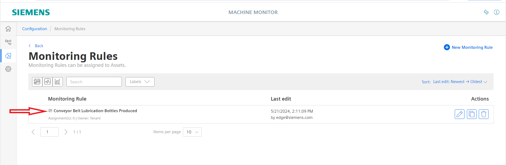
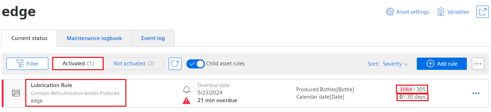
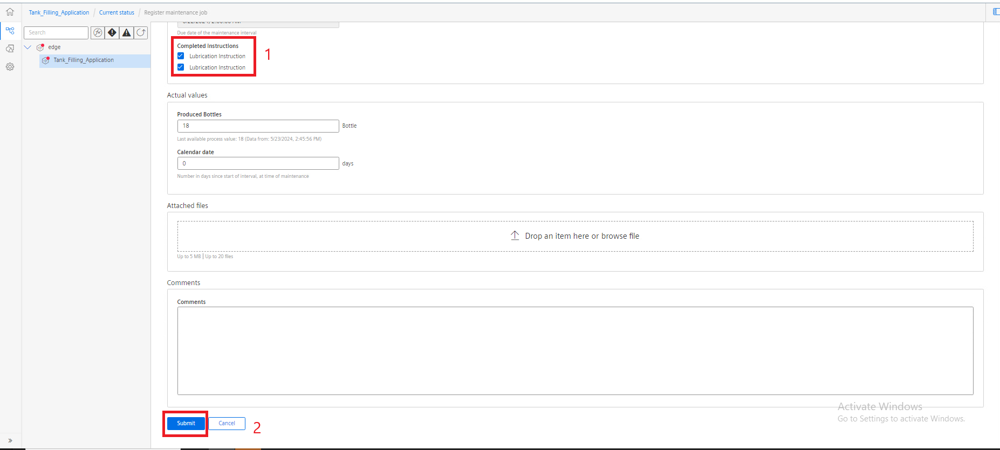

# Machine Monitor

This example shows how to use the Industrial Edge app "Machine Monitor".

- [Machine Monitor](#Machine-Monitor)
  - [Description](#description)
    - [Overview](#overview)
    - [General task](#general-task)
  - [Requirements](#requirements)
    - [Prerequisities](#prerequisities)
    - [Used components](#used-components)
    - [TIA project](#tia-project)
  - [Configuration steps](#configuration-steps)
  - [Usage](#usage)
  - [Documentation](#documentation)
  - [Contribution](#contribution)
  - [Licence and Legal Information](#licence-and-legal-information)
 - [Disclaimer](#disclaimer)

## Description

### Overview

The app Machine Monitor provides transparency of the maintenance status of connected machines and allows the user to fully utilize the capabilities of the Industrial Edge Ecosystem. This tutorial shows how to collect data from a PLC into the Industrial Edge system, followed by leveraging the data to have a better understanding of the machine state and finally provide transparency  of the maintenance status of the machine.

### General task

The example reads data from a PLC via the S7 Connector application using the S7 protocol. The acquired data is published to the Databus, from where the IIH Essentials is able to collect the data. The IIH Essentials allows the user to identify data points of interest, classify them as assests and store the data for further usage.

Afterwards, the Machine Monitor app connects to the IIH Essentials and allows the user to create rules and templates to adminstrate the maintenance process of the machine using the assets created in the IIH Essentials.

## Requirements

###  Prerequisities

- Access to an Industrial Edge Management System (IEM)
- Onboarded Industial Edge Device on IEM
- Installed System Configurators for Databus
- Installed System Apps Databus and S7 Connector
- Installed IIH Essentials
- Installed Machine Monitor
- Edge device is connected to PLC
- TIA portal project loaded on PLC
- HTML5-capable Internet browser (In general it is advised to use Chrome except for Linux based systems it is recommended to use Firefox)

### Used components

- Industrial Edge Management V2.6.1-4
  - Databus V3.2.1
  - S7 Connector V2.3.2
  - IIH Essentials V2.3.1
  - Machine Monitor V3.0.1
  - Common Configurator V2.3.1
- Industrial Edge Device V 3.1.0
- TIA Portal V20
- S7-PLCSIM Advanced V6.0

### TIA Project

The used TIA Portal project can be found in the miscellaneous repository under "[tank application](https://github.com/industrial-edge/miscellaneous/tree/main/tank%20application)".

## Configuration steps

You can find further information about the following steps in the [Configuration](/docs/Installation.md) documentation:

- [Configure PLC Connection](/docs/Installation.md#configure-plc-connection) (Databus, S7 Connector)
- [Configure IIH Essentials](/docs/Installation.md#configure-IIH-Essentials)
- [Configure Machine Monitor](/docs/Installation.md#configure-machine-monitor)

## Usage

Once the Machine Monitor application is successfully configured and deployed, service staff and machine operators can leverage the features provided by the Machine Monitor to manage the state of the machine and ensure the completion of all maintenance routines. In the figure below, the Machine Monitor app is used to configure a monitoring rules called "Conveyor Belt Lubrication - Bottles Produced." This rule ensures that the machine operator lubricates the conveyor belt used in the Tank example when specific conditions are met.

The mentioned rule consists of two triggers or conditions. When the trigger threshold is reached or met, the rule is activated, and the service staff is required to perform the corresponding maintenance routine instructed by the machine manufacturers. The following triggers are configured for this rule:

- Number of produced bottles
- Calender date

Once the number of produced bottles surpasses a certain value ("305 Bottles") or 30 calendar days have passed since the deployment of the rule, the service staff receives a notification indicating that the threshold value has been reached, and the maintenance routine defined in the Machine Monitor app must be carried out. The figure below displays the mentioned triggers.

After running the Tank Filling example simulation for a period of time, the rule is activated through the first trigger. The number of produced bottles has exceeded the threshold value, and the service staff is notified through the app. The figure below highlights the activation of the rule and provides the user with the status of the other trigger.

The service staff shall perform the corresponding maintenance routine and confirm this in the Machine Monitor app. After completing the maintenance task, the service staff shall log the details of the performed maintenance in the Machine Monitor app. The figure below illustrates the logging process, ensuring accurate and up-to-date records of the maintenance activities.

The Machine Monitor app will reset the rule that was triggered after the maintenance task is completed and the rule is no longer activated. The figure below introduces the state of the rule after carrying out the maintenance routine.

## Documentation

You can find further documentation and help in the following links:

  - [Industrial Edge Hub](https://iehub.eu1.edge.siemens.cloud/#/documentation)
  - [Industrial Edge Forum](https://www.siemens.com/industrial-edge-forum)
  - [Industrial Edge landing page](https://new.siemens.com/global/en/products/automation/topic-areas/industrial-edge/simatic-edge.html)
  - [Industrial Edge GitHub page](https://github.com/industrial-edge)

## Contribution

Thank you for your interest in contributing. Anybody is free to report bugs, unclear documentation, and other problems regarding this repository in the Issues section.
Additionally everybody is free to propose any changes to this repository using Pull Requests.

If you haven't previously signed the [Siemens Contributor License Agreement](https://cla-assistant.io/industrial-edge/) (CLA), the system will automatically prompt you to do so when you submit your Pull Request. This can be conveniently done through the CLA Assistant's online platform. Once the CLA is signed, your Pull Request will automatically be cleared and made ready for merging if all other test stages succeed.

## Licence and Legal Information

Please read the [Legal information](LICENSE.txt).

## Disclaimer

IMPORTANT - PLEASE READ CAREFULLY:

This documentation describes how you can download and set up containers which consist of or contain third-party software. By following this documentation you agree that using such third-party software is done at your own discretion and risk. No advice or information, whether oral or written, obtained by you from us or from this documentation shall create any warranty for the third-party software. Additionally, by following these descriptions or using the contents of this documentation, you agree that you are responsible for complying with all third party licenses applicable to such third-party software. All product names, logos, and brands are property of their respective owners. All third-party company, product and service names used in this documentation are for identification purposes only. Use of these names, logos, and brands does not imply endorsement.
