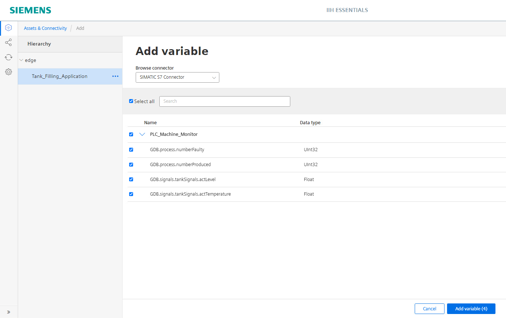
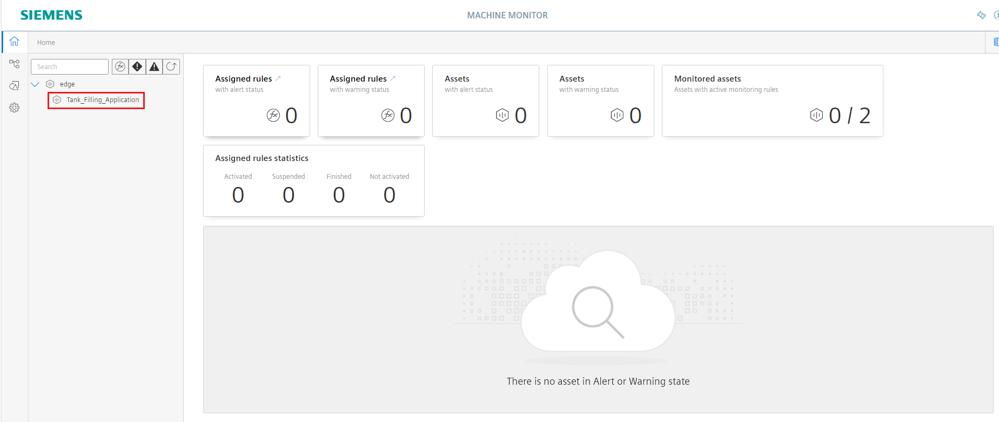

# Configuration

- [Configuration](#configuration)
  - [Configure PLC connection](#configure-plc-connection)
    - [Configure Databus](#configure-databus)
    - [Configure S7 Connector](#configure-s7-connector)
  - [Configure IIH Essentials](#configure-IIH-Essentials)
    - [Configure the adapter](#configure-the-adapter)
    - [Configure an asset with variables](#configure-an-asset-with-variables)
  - [Configure Machine Monitor](#configure-machine-monitor)
    - [Configured parameters](#configured-parameters)
    - [Connectivity troubleshooting](#connectivity-troubleshooting)
    - [Configuring rules and templates](#configuring-rules-and-templates)
      - [Configuring the first rule](#configuring-the-first-rule)
      - [Configuring the second rule](#configuring-the-second-rule)
      - [Configuring the third rule](#configuring-the-third-rule)
    - [Assigning rules to asset](#assigning-rules-to-assets)
    - [Rules activation](#rules-activation)
    - [Maintenance routine logging](#maintenance-routine-logging)
    - [Machine Monitor extrapolation feature](#machine-monitor-extrapolation-feature)
    - [Operating hours counter](#Operating-hours-counter)
    - [Machine Monitor maintenance logbook and event log](#machine-monitor-maintenance-logbook-and-event-log)
    - [Notification settings](#notification-settings)
    - [Backup and restore function](#backup-and-restore-function)
    - [Customization of the Machine Monitor app](#customization-of-the-machine-monitor-app)

## Configure PLC connection

To retrieve data from the Programmable Logic Controller (PLC), the S7 Connector app is used. The connector establishes a connection to the PLC through the S7 optimized Protocol. The S7 Connector transfers the acquired data to the Databus, enabling the IIH Essentials app to receive it. Subsequently, users can configure specific data points of interest as assets. These assets are then accessible to the Machine Monitor app, which allows users to define maintenance rules and templates to govern the machine's state. As mentioned earlier, we will use the tank application example to demonstrate the features of the Machine Monitor application:

In order to build this infrastructure, the followings apps must be configured properly:

- S7 Connector
- Databus
- IIH Essentials
- Machine Monitor

### Configure Databus

In your IEM open the Databus and launch the configurator.

Add a user with this topic:
`"ie/#"`

The user can preview if the topic was created successfully:

Last step is to deploy the configuration.

### Configure S7 Connector

In your IEM open the S7 Connector and launch the configurator.

Add a data source:

For this example the following tags are added:

- GDB.signals.tanksSignals.actLevel
- GDB.signals.tankSignals.actTemprature
- GDB.process.numberProduced
- GDB.process.numberFaulty

Edit the settings:

Hint: Username and password should be the same for all system apps, e.g. "edge" / "edge".

Deploy and start the project.

## Configure IIH Essentials

In your IED Web UI open the app IIH Essentials.

### Configure the adapter

Click on the icon `"Settings"` on the left side bar. The open the databus settings and enter the user name and password of user created in Databus Configurator.

Click on the icon `Connectors` on the left sidebar. To add a connector click on the `plus` icon. IIH Essentials discovers automatically all available connectors. In this example, the SIMATIC S7 Connector is used for the data collection.

To use the connector click on `Add`. After that the connector must be activated. Therefore select this connector and click on `edit`, set `status` to active and save.

The connector (here SIMATIC S7 Connector) is now activated and connected to the IIH Essentials.

Once the SIMATIC S7 Connector is activated, Follw the Configure an asset with variable for configuration of Assets and Variables

### Configure an asset with variables

An asset is a digital representation of a machine or automation system with one or more automation units (e.g.PLC). The data that describes an Asset is collected and stored. The data is then available for further processing and evaluation.

On the left sidebar, click the `Assets & Connectivity` icon. Under "Hierarchy," you can find the parent asset "edge." To enable the Machine Monitor example to collect data from the IIH Essentials app, you need to create a child asset "Tank_Filling_Application" in the IIH Essentials with a name for the machine.

 

If you click the Add variable, In the Browse connector tab you have to select SIMATIC S7 Connector.

Once you select the SIMATIC S7 Connector under the Browse connector tab, you have the select these four tags which is mentioned bellow:

- GDB.process.numberFaulty
- GDB.process.numberProduced
- GDB.signals.tankSignals.actLevel
- GDB.signals.tankSignals.actTemperature

The child asset is named " Tank_Filling_Application", the user is free to name the chil asset as needed. Click "Add multiple variables" on the right side to collect the needed data points from the S7 Connector. 

By clicking on the **variables preview** icon, the user can check if the data is being collected correctly from the Databus and get a preview of the collected data.

## Configure Machine Monitor

To access the Machine Monitor application, the user needs to install it on the IE Device and click on the application icon. Upon opening the application, the user will see the following figure:

 

The assets configured in the IIH Essentials app are imported by the Machine Monitor app. By default, the Machine Monitor starts by opening the parent asset, which in this case is "edge." However, in this example, the child asset "Tank_Filling_Application" is where the assets are configured. The user can click on the child asset, as highlighted in the figure, to preview the available variables and explore all the features.

### Configured parameters

After selecting the "Tank_Filling_Application" child asset, click on the dropdown button highlighted in the picture below and select "variables":

The user can now see all the configured data points for this asset, as shown in the figure below. The "Tank_Filling_Application" asset has four data points configured:

- Number of Produced Bottles
- Number of Faulty Produced Bottles
- Tank Temperature in celsius
- Tank level in liters

The Machine Monitor example utilize these acquired data points to create maintenance rules and templates to govern the state and health of the process. In this example four rules will be created to demonstrate the features of the applications. The first rule states that when the number of produced bottles exceeds a certain number, a maintenance routine has to be carried out. A second rule can be created for the number of faulty bottles, where if the value of the variable exceeds a certain threshold, the process has to be stopped and inspected. Third and fourth rules can be created for the temperature and level of the tank to ensure that the process is running correctly and the system is free from any issues.

### Connectivity troubleshooting

Note: If the configured parameters do not appear in the Machine Monitor application, the user needs to check the configuration of the IIH Essentials application and then verify the credentials used for connecting the Machine Monitor application to the Databus. To do this, click on the "Settings" tab in the sidebar and then select "Connectivity Configuration," as highlighted in the figure below:

 

The user will then see the figure below and can check the credentials and address used for connecting the Machine Monitor app to the Databus app, as well as test the connection:

### Configuring rules and templates

After ensuring that the Machine Monitor app is connected to the Databus and able to collect the desired data points, the user can proceed to configure rules or templates and associate them with single or multiple data points to monitor the machine's state.

The Machine Monitor application offers three different rule types to choose from :

- Intervals
- Parameter limits
- 2-D characteristic curve

The **Intervals** rule allows the user to define either a time parameter or a usage parameter as a trigger. Once an interval rule is triggered, it can be repeated multiple times based on specific requirements.

The **Parameter limits** rule allows the user to select a particular process value and define a threshold for it. When the threshold is exceeded, the Monitoring rule is triggered.

The **2-D characteristic curve** type enables the integration of the "Data Explorer" app, allowing the creation of a Monitoring rule based on the relationship between two datasets derived from the process values. However, for the purpose of this example and its scope, only the "Intervals" and "Parameter limits" types will be demonstrated.

To begin configuring rules, click on the "Configuration" icon in the sidebar, and then select "Monitoring Rules," as highlighted in the figure below.

 

The user will be directed to the page shown in the figure below. If any previous rules have been configured, they can be previewed here. To create a new rule, click on the "New Monitoring Rule" button, as highlighted in the figure below.

> Note: If the browser being used is not compatible with the system, the Machine Monitor app may not display the "New Monitoring Rule" button.

In this example, three rules will be created to demonstrate the features of the Machine Monitor app:

- Conveyor Belt Lubrication-Bottles Produced
- Tank-Health State
- Quality Control-Defective Bottles

### Configuring the first rule

Click "New Monitoring Rules" to create a rule "Conveyor Belt Lubrication - Bottles Produced" for the lubrication of the conveyor belt used to transport the produced bottles. Firstly, the user needs to provide a name for the rule and choose the rule type "Intervals":

Set two Parameter(s) for the rule: the usage parameter and the time parameter. In summary, both parameters are defined, and when either of them is exceeded, the Machine Monitor notifies the machine operator that a maintenance routine needs to be performed.

Once the triggers for the rule have been defined, the user needs to specify the interval pattern. This pattern determines how the machine operator should carry out the maintenance and if any routine should be repeated. The available patterns and their explanations are shown in the figure below:

Click on interval one to see the settings. Next, the user can define the "Due limit" and "Overdue limit" for the "Produced Bottles" trigger and set the periodic maintenance period for the conveyor belt. To create new instructions for the maintenance routine, click on "Create New Instruction":

In the instructions section, it is possible to provide text instructions or add a PDF file to guide the maintenance team:

After configuring the relevant instructions and settings, the Machine Monitor allows the user to add any relevant documents to the maintenance process in the final step:

Clicking on "Finish" completes the configuration process, and the rule "Conveyor Belt Lubrication - Bottle Produced" can be previewed in the configuration window:

### Configuring the second rule

Click "New Monitoring Rule" to create a second rule "Tank - Health State" with the rule type "Parameter limits". This rule monitors the health state of the process based on two parameters:

- The actual level of the liquid in the tank
- The tank temperature

The configuration of the second rule follows the same process as the first rule:

The user needs to define limits for the configured triggers. As highlighted in the figure below, the user must set limits for three main sections:

- The alert and warning section for values lower than the accepted threshold
- The accepted range for the threshold value
- The alert and warning section for values above than the acccepted threshold

The user also needs to define the lowest and highest values for the trigger. For example, for the temperature parameter, the range is set from 0 to 100 °C. The figure below shows the values provided for the temperature trigger, and the same process is followed for the liquid level parameter.

Similar to the first rule, the user can create instructions and add maintenance documents if needed.

### Configuring the third rule

Click "New Monitoring Rule" to create a third rule "Quality Control - Defective Bottles" with the rule type "Intervals". This rule monitors the quality and efficiency of the production line based on the remaining parameter "numberFaulty". As highlighed in the figure below, once the number of defective bottles reach 200 bottle, the rule will be triggered and the service staff will have to carry out the linked instruction.

The procedure to create this rule is the same as the two previous rules. If everything has been done correctly, the user can now see the available templates, as highlighted in the figure below:

### Assigning rules to assets

The three rules are now configured and ready to be associated with the corresponding assets. To assign rules to assets, the user needs to open the "Overview" tab and click on "Add rule" and select "Assign predefined monitoring rules" as highlighted in the figure below:

Select all the three Monitoring rules and click "assign" as highlighted below:

All three rules are assigned to the child asset named "Tank_Filling_Application". The last step is to connect each rule with the corresponding process value. The user can see all the assigned rules by clicking on each rule, as highlighted in the figure below. By clicking on each rule, it is possible to configure the process value associated with the rule. Now, click on the rule "Conveyor Belt Lubrication - Bottle Produced" to finish the configuration process:

The figure below highlights the necessary inputs that the user has to provide to configure the rule named "Conveyor Belt Lubrication - Bottle Produced" of type "Interval": 

1. Define a component identifier

2. Define when the Machine Monitor app should start applying the rule

This rule had two triggers, the first trigger is the number of produced bottles and the second is a Date

3. Choose the parameter of relevance to the rule (for this rule, select the Number of Produced Bottles) and aggregation type (None)

Note: The Machine Monitor app provides the user with a projection for connected parameters based on two methods (Linear extrapolation or Polynomial extrapolation )

4. Since the second trigger is a date, there is no more configuration needed

After providing all the required information, click on "Save". By following the same steps, the user can configure the remaining two rules. The only difference is that for the parameter-based rule, the user defines the "Calculation period" instead of the interval starting time for the rule to perform the aggregation process if required.

### Rules activation

The user can now see that all the rules are marked as completed but not yet activated:

The "Lubrication Rule" is activated first to introduce the application features. This is done by clicking on the three dots and selecting "Activate". The rule is now activated. After activating the rule and letting it run until we receive the first notification. As shown in the figure below, the "Lubrication Rule" is activated and it has produced its first alert. This rule has one trigger: the number of Faulty bottles. The number of Faulty bottles has reached the maintenance limit that we previously defined (Due limit: 300 Bottles, Overdue limit: 305 Bottles).

By clicking on the rule, the user can preview the current state and monitor any changes in either of the two triggers. For the produced bottles trigger, it can be deduced that it has already reached the limit and exceeded it by 3 bottles. As for the second trigger, there are still 29 days remaining. To remove the alert state of the rule, the machine operator has to carry out the maintenance routine. This can be registered using the "Register Maintenance" button highlighted in red in the figure below.

### Maintenance routine logging

By clicking on the "Lubrication Rule", the user needs to select the "Maintenance" and then "Register maintenance job" as highlighted in step 1 and then step 2.

By clicking on "Register Maintenance job", the user can start entering the details of the maintenance that was carried out. The user needs to check the list of instructions as highlighted in step 1 and then click on "Submit" as step 2.

After submitting the maintenance, the Machine Monitor app resets the rule and logs the maintenance activity in the maintenance log. Now the status of the rule is changed to "Ok".

> Note: The Machine Monitor app acquires data every 20 seconds. However, in future versions, the Machine Monitor app will be able to acquire data at a faster rate.

### Machine Monitor extrapolation feature

Regarding the extrapolation feature that the Machine Monitor app provides, the user can preview the estimation provided by the app by clicking on the icon highlighted in the figure below. The app provides the user with an estimation regarding how much time is left until the limit is reached and a projection for future values.

### Operating hours counter

Service and maintenance teams frequently rely on the operating hours of a machine as a parameter to determine the machine's health state and when maintenance should be performed. The Machine Monitor app enables users to create an operating hours counter, even if it wasn't programmed in the controller or directly available through the machine. To configure the operating hours counter, a new rule of type "Intervals" is created to demonstrate the process.

The maintenance trigger is named "Operating Hours" and has a unit type of "Hour"

The due limit for the trigger is set at "10,000" hours, and the overdue limit is "10,005" hours, these values can be defined by the user as needed or instructed by the machine builder.

To assign the rule to the asset, click on "Add rule" and then assign the rule to the asset, similar to the configuration process for previous rules. The next step involves providing a component identifier for the rule, linking the rule with a process value, and choosing the appropriate aggregation type.

Although there may not be a parameter indicating the operating hours of the machine, the Machine Monitor app allows users to create the operating hours counter using other process values. This is achieved by linking a process value to the rule and selecting the "Timer" aggregation type. When the linked process value has a value greater than zero, the timer will start, considering the machine to be operating and counting the operating hours. Detailed explanations of different aggregation types can be found in the Machine Monitor manual. The figure below highlights how to link and configure the aggregation type. In this example, the variable "bottles produced" is linked to the rule, and the "Timer" aggregation type is selected with "Hour" as the unit. As long as the "bottles produced" variable has a value greater than 0, the timer will track the machine's operating hours. It's worth noting that the linked variable can be of type "Boolean," and the timer will be on whenever the value is set to "True" and turn off when the value becomes "False."

After activating the rule, users can verify the successful creation of the operating hours counter by clicking on the "Operating Hours Counter" rule.

Users can now confirm that the counter has been successfully created, and the machine's operating hours are being monitored, even without a direct variable tracking the hours.

### Machine Monitor maintenance logbook and event log

The Machine Monitor app provides the user with two logging mechanisms to track the state of different rules and whether a maintenance job was carried out.

The tab **Maintenance logbook** tracks all the maintenance jobs that have been performed and any changes or resets to the rules. The maintenance job that was carried out earlier in this example is logged in the maintenance logbook.

The tab **Event log** provides the user with an overview of the state of the activated rules. It lists details regarding the state of different rules and when they switched states.

### Notification settings

The Machine Monitor apps provides the user with the ability to send notification in case a rule reached the threshold value or a maintenance job is required. The user can either connect the Machine Monitor app to the Notifier app or use the Machine Monitor app directly to send emails.

In order to configure this feature, the user needs to clicks on "Asset settings".

Enable the connection to the Notifier app or enable the Email function (therefore the user needs also setup the connection to an email server via the settings page).

### Backup and restore function

The user can save the configuration of the Machine Monitor app using the "Backup and restore" function. In order to use this function, the user has to click on "Settings" then "Backup and restore". The user can either create a backup or restore a backup file.By utilizing the backup and restore feature, the user can easily save and restore the app configuration as needed. The figure below highlights the steps needed to create and download the backup file.

Note: The structure of the Machine Monitor is directly related to the structure of the IIH Essentials app, if the configuration of the IIH Essentials app changes after the creation of the backup this will lead to a mismatch error in the Backup file.

### Customization of the Machine Monitor app

The user can also customize the app logo and upload a new one, this can be done by clicking "Settings" and then "User Information".

Within the area "Custom logo" the user can upload a new logo. This replaces the "Siemens" logo and will be displayed in the top left corner of the application.

This allows the user to personalize the Machine Monitor app with their own logo, adding an unique touch to the application's appearance.
