# Configuration

- [Configuration](#configuration)
  - [Configure PLC Connection](#configure-plc-connection)
    - [Configure Databus](#configure-databus)
    - [Configure S7 Connector](#configure-s7-connector)
  - [Configure Data Service](#configure-data-service)
    - [Configure the adapter](#configure-the-adapter)
    - [Configure an asset with variables](#configure-an-asset-with-variables)
  - [Configure Machine Monitor](#configure-machine-monitor)
    - [Configured Parameters](#configured-parameters)
    - [Connectivity Troubleshooting](#connectivity-troubleshooting)
    - [Configuring Rules and Templates](#configuring-Rules-and-Templates)
    - [Configuring the first rule](#configuring-the-first-rule)
    - [Configuring the second rule](#configuring-the-second-rule)
    - [Configuring the Third Rule](#configuring-the-third-rule)
    - [Assigning Rules to Asset](#assigning-rules-to-assets)
    - [Rules Activation](#rules-activation)
    - [Maintenance Routine logging](#maintenance-routine-logging)
    - [Machine Monitor Extrapolation Feature](#machine-monitor-extrapolation-feature)
    - [Machine Monitor Maintenance logbook and Event log](#machine-monitor-maintenance-logbook-and-event-log)
    - [Notification settings](#notification-settings)
    - [Backup and restore function](#backup-and-restore-function)
    - [Customisation of the Machine Monitor app](#customisation-of-the-machine-monitor-app)
## Configure PLC Connection

To retrieve data from the Programmable Logic Controller (PLC), the S7 Connector app is used. The connector establishes a connection to the PLC through the S7 optimized Protocol. The S7 Connector transfers the acquired data to the Databus, enabling the Data Service app to receive it. Subsequently, users can configure specific data points of interest as assets. These assets are then accessible to the Machine Monitor app, which allows users to define maintenance rules and templates to govern the machine's state. As mentioned earlier, we will use the tank application example to demonstrate the features of the Machine Monitor application:

In order to build this infrastructure, the followings apps must be configured properly:

- S7 Connector
- Databus
- Data Service
- Machine Monitor

### Configure Databus

In your IEM open the Databus and launch the configurator.

Add a user with this topic:
`"ie/#"`

The user can preview if the topic was created successfully:

Last step is to deploy the configuration.

### Configure S7 Connector

In your IEM open the S7 Connector and launch the configurator.

Add a data source:

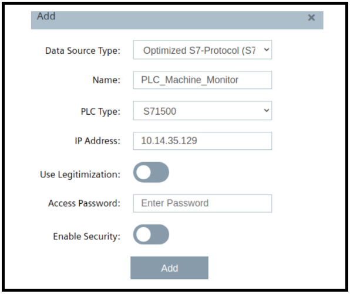

For this example the following tags are added:

Edit the settings:

Hint: Username and password should be the same for all system apps, e.g. "edge" / "edge".

Deploy and start the project.

## Configure Data Service

In your IED Web UI open the app Data Service.

### Configure the adapter

Click the icon "Adapters" on the left bar. The Data Service provides users with the ability to collect data from the different connectors. In this example, the S7-connector is used for the data collection.

To connect to an adapter choose the adapter you want to use. Click the edit icon on the right side of the SIMATIC S7 Connector option to open the adapter configuration. The Broker URL should be prefilled with `"tcp://ie-databus:1883"`. Add the missing entries for username and password (again "edge"/"edge"). Set the status to 'Active' and save your configuration.

The adapter (in rhis case, SIMATIC S7 Connector) should now be activated and connected to the Data Service.

### Configure an asset with variables

On the left sidebar, click the "Assets & Connectivity" icon. Under "Hierarchy," you can find the parent asset "edge." To enable the Machine Monitor Example to collect data from the Data Service app, you need to create a child asset in the Data Service with a name for the machine. In the current release of the Machine Monitor, it is not possible to collect data from the parent asset "edge."

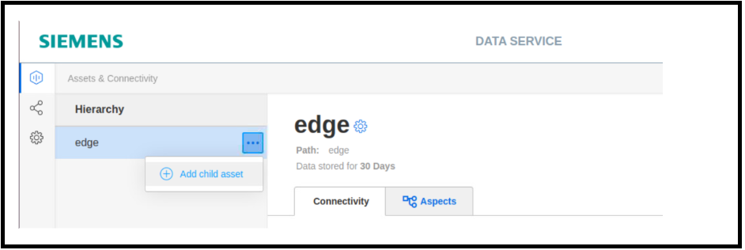

The child asset is named " Tank_Filling_Application", the user is free to name the chil asset as needed. Click "Add multiple variables" on the right side to collect the needed data points from the S7 Connector. 

By clicking on the **variables preview** icon, the user can check if the data is being collected correctly from the IE Databus and get a preview of the collected data.

## Configure Machine Monitor

To access the Machine Monitor application, the user needs to install it on the IE Device and click on the application icon. Upon opening the application, the user will see the following figure:

 

The settings configured in the Data Service app are imported by the Machine Monitor app. By default, the Machine Monitor starts by opening the parent asset, which in this case is "edge." However, in this example, the child asset "Tank_Filling_Application" is where the assets are configured. The user can click on the child asset, as highlighted in the figure, to preview the available parameters and explore all the features.

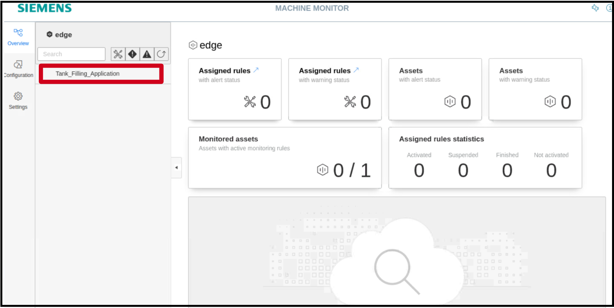

### Configured Parameters

After selecting the "Tank_Filling_Application" child asset, click on the dropdown button highlighted in the picture below and select "parameters":

The user can now see all the configured data points for this asset, as shown in the figure below. The "Tank_Filling_Application" asset has four data points configured:

- Number of Produced Bottles
- Number of Faulty Produced Bottles
- Tank Temperature in celsius
- Tank level in liters

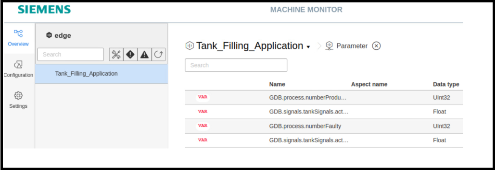

The Machine Monitor example utilize these acquired data points to create maintenance rules and templates to govern the state and health of the process. The first rule states that when the number of produced bottles exceeds a certain number, a maintenance routine has to be carried out. A second rule can be created for the number of faulty bottles, where if the value of the variable exceeds a certain threshold, the process has to be stopped and inspected. Third and fourth rules can be created for the temperature and level of the tank to ensure that the process is running correctly and the system is free from any issues.

### Connectivity Troubleshooting

Note: If the configured parameters do not appear in the Machine Monitor application, the user needs to check the configuration of the Data Service application and then verify the credentials used for connecting the Machine Monitor application to the Data Bus. To do this, click on the "Settings" tab in the sidebar, and then select "Connectivity Configuration," as highlighted in the figure below:

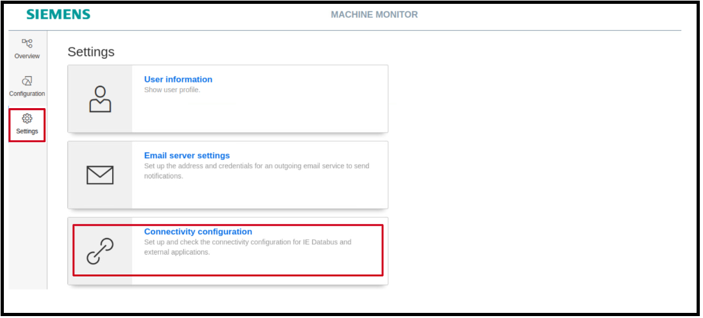

The user will then see the figure below and can check the credentials and address used for connecting the Machine Monitor app to the Data Bus app, as well as test the connection:

 

### Configuring Rules and Templates

After ensuring that the Machine Monitor app is connected to the Data Bus and able to collect the desired data points, the user can proceed to configure rules or templates and associate them with single or multiple data points to monitor the machine's state.

To begin configuring templates, click on the "Configuration" icon in the sidebar, and then select "Maintenance Rules," as highlighted in the figure below.

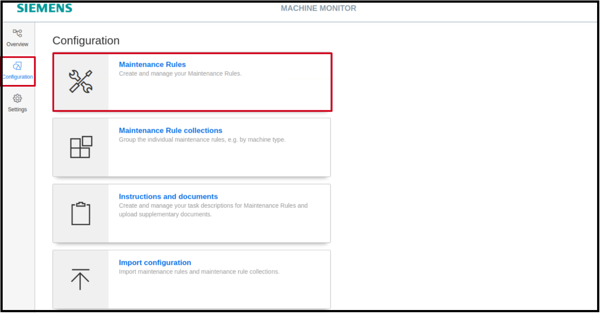 

The user will be directed to the page shown in the figure below. If any previous templates have been configured, they can be previewed here. To create a new template, click on the "New Maintenance Rule" button, as highlighted in the figure below.

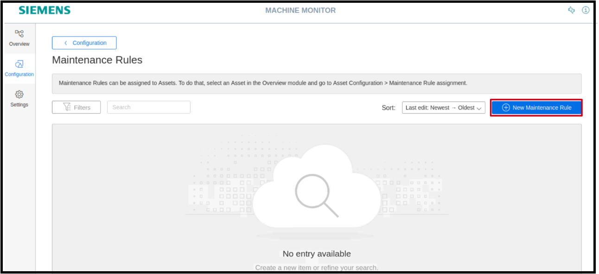

Note: If the browser being used is not compatible with the system, the Machine Monitor app may not display the "New Maintenance Rule" button.

In this example, three rules have been created and configured to demonstrate the features of the Machine Monitor app:

Three rules are created and configured in this example to demonstrate the features of the Machine Monitor app.
- Conveyor Belt Lubrication-Bottles Produced
- Tank-Health State
- Quality Control-Defective Bottles

### Configuring the First Rule

The user can begin defining the configuration of the template. As an example, a template is created for the lubrication of the conveyor belt used to transport the produced bottles. Firstly, the user needs to provide a name for the template (for this example, "Conveyor Belt Lubrication - Bottles Produced") and choose a rule type, as highlighted in the figure below:

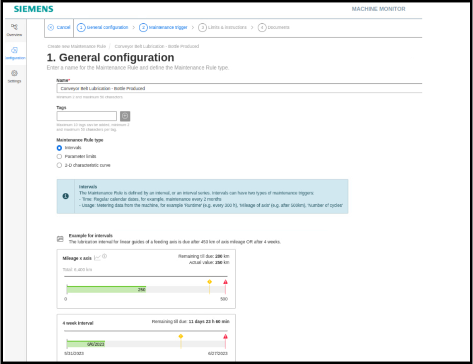

The Machine Monitor application offers three different rule types to choose from :

- Intervals
- Parameter Limits
- 2-D characteristic curve

The Interval rule allows the user to define either a time parameter or a usage parameter as a trigger. Once an interval rule is triggered, it can be repeated multiple times based on specific requirements. The Parameter Limits rule allows the user to select a particular process value and define a threshold for it. When the threshold is exceeded, the maintenance rule is triggered. The 2-D Characteristic Curve type enables the integration of the "Data Explorer" app, allowing the creation of a maintenance rule based on the relationship between two datasets derived from the process values. However, for the purpose of this example and its scope, only the "Intervals" and "Parameter Limits" types will be demonstrated.

The created rule is used to govern the maintenance and lubrication schedule of the conveyor belt used for transporting the produced bottles. For this rule, the Interval type is chosen, and two triggers are set: the usage parameter and the time parameter. In summary, both parameters are defined, and when either of them is exceeded, the Machine Monitor notifies the machine operator that a maintenance routine needs to be performed.

Once the triggers for the rule have been defined, the user needs to specify the interval pattern. This pattern determines how the machine operator should carry out the maintenance and if any routine should be repeated. The available patterns and their explanations are shown in the figure below:

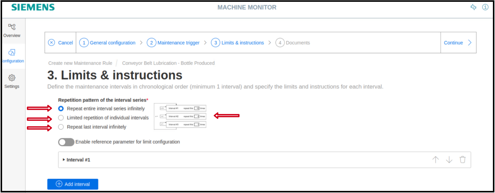

Next, the user can define the "Due limit" and "Overdue limit" for the "Produced Bottles" trigger and set the periodic maintenance period for the conveyor belt. To create new instructions for the maintenance routine, click on "Create New Instruction," as highlighted in the figure below.

In the instructions section, it is possible to provide text instructions or add a PDF file to guide the maintenance team, as shown in the figure below:

After configuring the relevant instructions and settings, the Machine Monitor allows the user to add any relevant documents to the maintenance process in the final step:

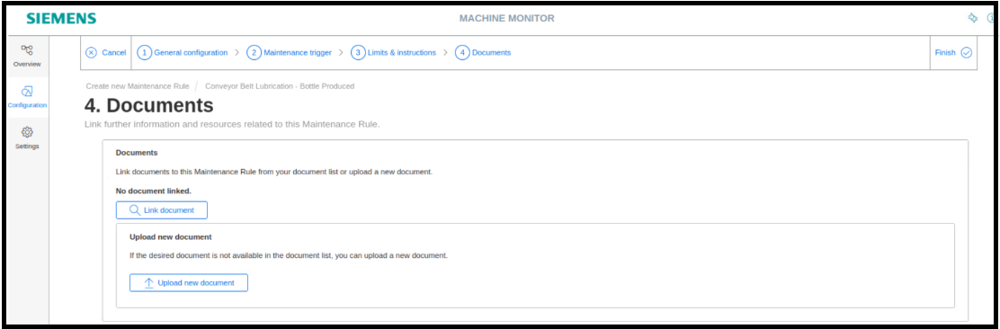

Clicking on "Finish" completes the configuration process, and the rule "Conveyor Belt Lubrication - Bottles Produced" can be previewed in the Configuration window, as highlighted in the figure below:

### Configuring the Second Rule

A second rule, "Tank - Health State," is created using the Maintenance Rule Type "Parameter Limits." This rule monitors the health state of the process based on two parameters:

- The actual level of the liquid in the tank
- The tank temperature

The configuration of the second rule follows the same process as the first rule.

The user needs to define limits for the configured triggers. As highlighted in the figure below, the user must set limits for three main sections:

- The alert and warning section for values lower than the accepted threshold
- The accepted range for the threshold value
- The alert and warning section for values above than the acccepted threshold

The user also needs to define the lowest and highest values for the trigger. For example, for the temperature parameter, the range is set from 0 to 100 °C. The figure below shows the values provided for the temperature trigger, and the same process is followed for the liquid level parameter.

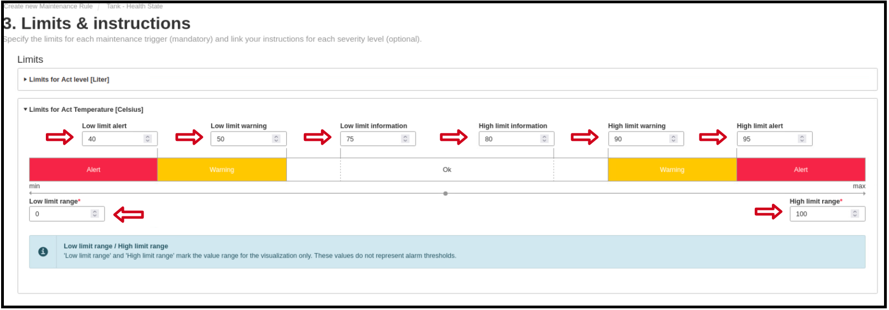

Similar to the first rule, the user can create instructions and add maintenance documents if needed.

### Configuring the Third Rule

Using the remaining process value "numberFaulty," the third rule "Quality Control - Defective Bottles" is created to monitor the quality and efficiency of the production line. The procedure to create this rule is the same as the two previous rules. If everything has been done correctly, the user can now see the available templates, as highlighted in the figure below:

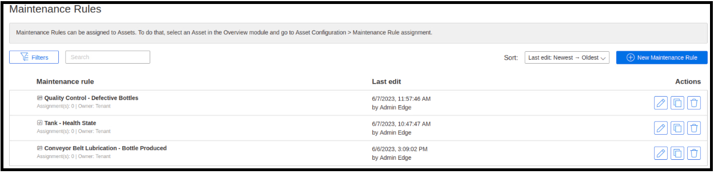

### Assigning Rules to Assets

The three rules are now configured and ready to be associated with the corresponding assets. To assign rules to assets, the user needs to open the "Overview" tab and click on "Asset Configuration" or "Go to Asset Configuration":

Click on " Assign Maintenance Rules :

Select all the three rules and click "assign" as highlighted below:

All three rules are assigned to the child asset named "Tank_Filling_Application". The last step is to connect each rule with the corresponding process value. The user can see all the assigned rules by clicking on each rule, as highlighted in the figure below. By clicking on each rule, it is possible to configure the process value associated with the rule. Now, click on the first rule "Conveyor Belt Lubrication" to finish the configuration process:

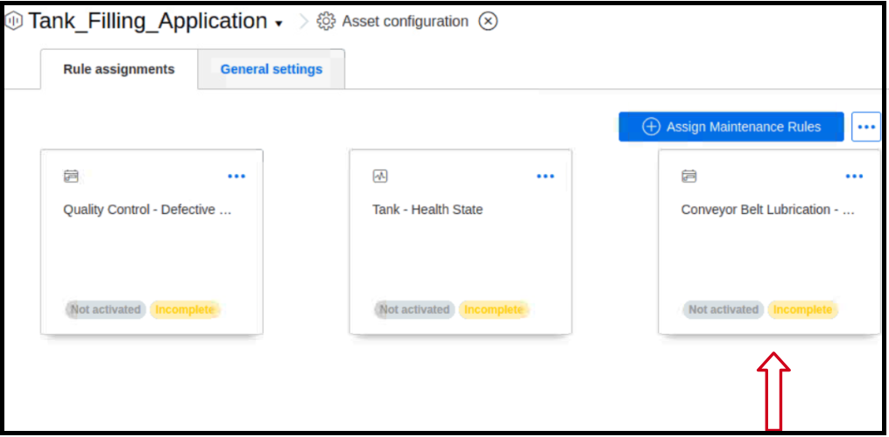

The figure below highlights the necessary inputs that the user has to provide to configure the rule named " Conveyor Belt Lubrication - Bottle Produced": 

1- Define a component identifier

2- Define when should the Machine Monitor app start applying the rule

This rule had two triggers, the first trigger is the number of produced bottles and the second is a Date:

3- Choose the parameter of relevance to the rule (For this rule, select the Number of Produced Bottles)

Note: The Machine Monitor app provides the user will a projection for connected parameters based on two methods (Linear extrapolation or Polynomial extrapolation )

4- Since the second trigger is a Date, there is no more configuration needed

After providing all the required information, click on "Save". By following the same steps, the user can configure the remaining two rules. The only difference is that for the parameter-based rule, the user defines the "Calculation period" instead of the interval starting time in order for the rule to perform the aggregation process if required.

### Rules Activation

The user can now see that all the rules are marked as completed but not yet activated:

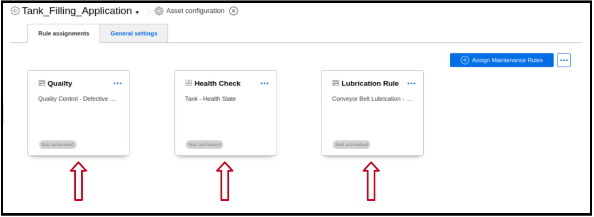

The "Lubrication Rule" is activated first to introduce the application features. This is done by clicking on the three dots and selecting "Activate". The rule is now activated, as highlighted below:

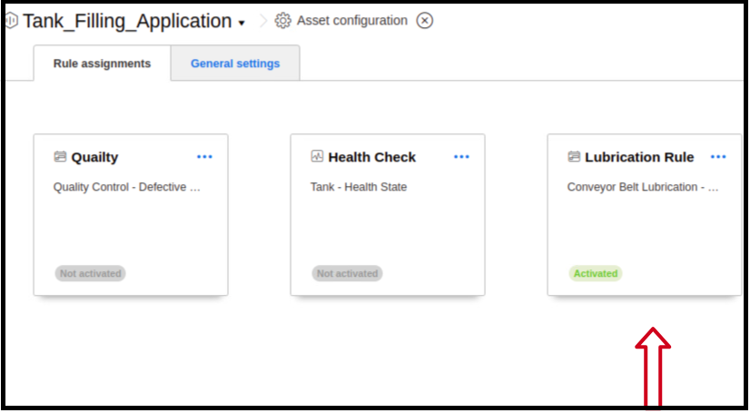

After activating the rule and letting it run until we receive the first notification, the user can preview the rule by clicking on the child asset "Tank_Filling_Application". As shown in the figure below, the "Lubrication Rule" is activated and it has produced its first alert. This rule has two triggers: the number of produced bottles and a calendar date. The number of produced bottles has reached the maintenance limit that we previously defined (Due limit: 300 Bottles, Overdue limit: 305 Bottles), triggering the rule:

By clicking on the rule, the user can preview the current state and monitor any changes in either of the two triggers. For the produced bottles trigger, it can be deduced that it has already reached the limit and exceeded it by 21 bottles. As for the second trigger, there are still 29 days remaining. To remove the alert state of the rule, the machine operator has to carry out the maintenance routine. This can be registered using the "Register Maintenance" button highlighted in red in the figure below:

### Maintenance Routine logging

By clicking on "Register Maintenance", the user can start entering the details of the maintenance that was carried out. The user needs to check the box as highlighted in step 1 and then click on "Submit" as step 2:

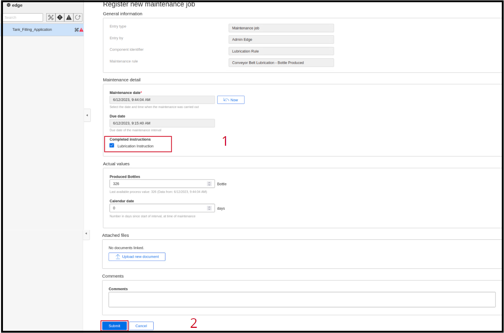

After submitting the maintenance, the Machine Monitor app resets the rule and logs the maintenance activity in the maintenance log. Now the status of the rule is changed to "Ok (not due)", as highlighted in the figure below:

Note: The Machine Monitor app acquires data every 20 seconds. However, in future versions, the Machine Monitor app will be able to acquire data at a faster rate.

### Machine Monitor Extrapolation Feature

Regarding the extrapolation feature that the Machine Monitor app provides, the user can preview the estimation provided by the app by clicking on the icon highlighted in the figure below. The app provides the user with an estimation regarding how much time is left until the limit is reached and a projection for future values.

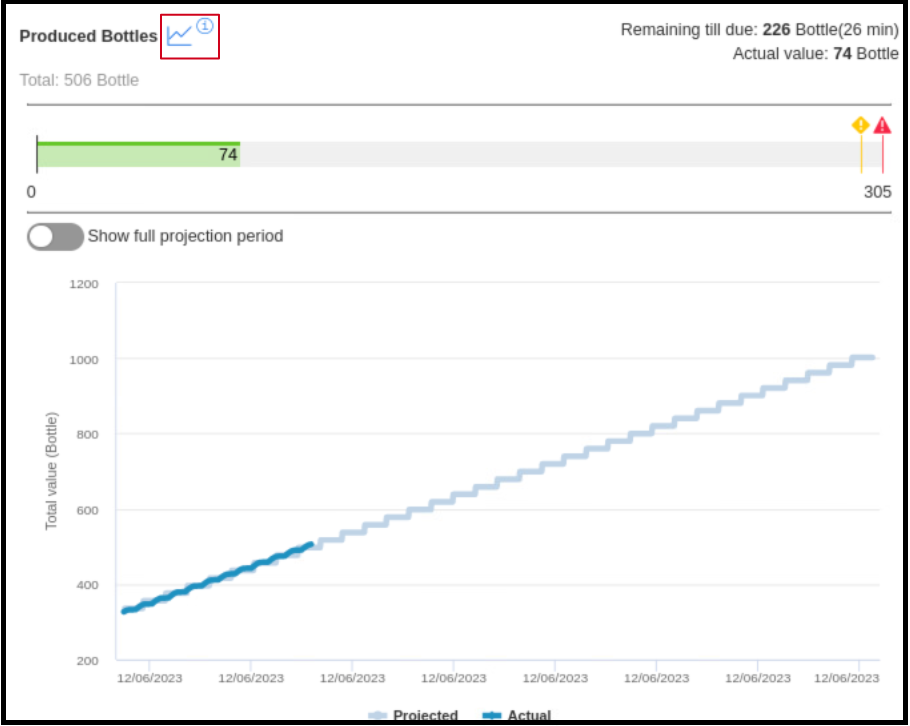

### Machine Monitor Maintenance logbook and Event log

The Machine Monitor app provides the user with two logging mechanisms to track the state of different rules and whether a maintenance job was carried out. The figure below shows the functionality of the "Maintenance Logbook". This logbook tracks all the maintenance jobs that have been performed and any changes or resets to the rules. The maintenance job that was carried out earlier in this example is logged in the maintenance logbook and can be seen as highlighted in the figure below:

The Event Log provides the user with an overview of the state of the activated rules. As shown in the figure below, the Event Log provides details regarding the state of different rules and when they switched states:

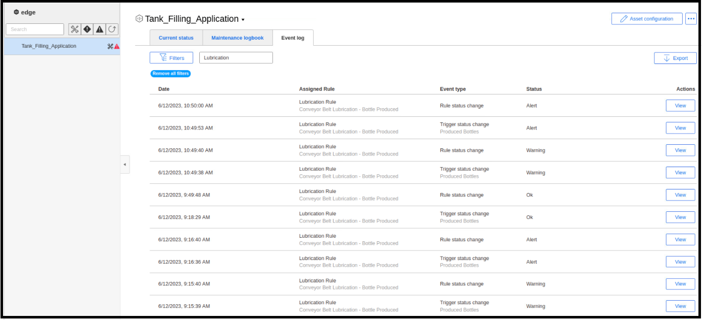

### Notification settings

The Machine Monitor apps provides the user with the ability to send notification in case a rule reached the threshold value or a maintenance job is required. The user can either connect the Machine Monitor app to the Notifier app or use the Machine Monitor app directly to send emails.

In order to configure this feature, the user clicks on " Asset configuration ":

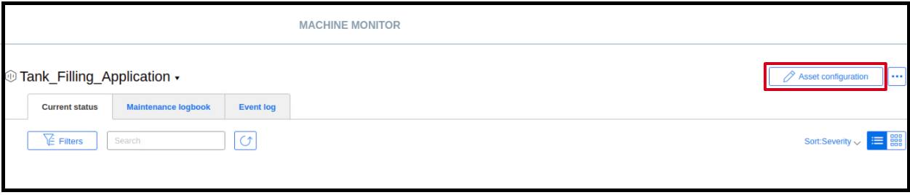

Next, click on " General Settings " from there it is possible to enable the connection to the Notifier app or to enable the Email function after configuring the Email Server setting from the Settings page:

### Backup and restore function

The user can save the configuration of the Machine Monitor app using the " Backup and restore " function. In order to use this function, the user has click on "Settings" then" Backup and restore ". As shown in the figure below, the user can either create a backup or restore a backup file. 

By utilizing the backup and restore feature, the user can easily save and restore their app configuration as needed.

### Customisation of the Machine Monitor app

The user can also customise the app logo and upload a new one, this can be done by clicking " Settings " and then " User Information ":

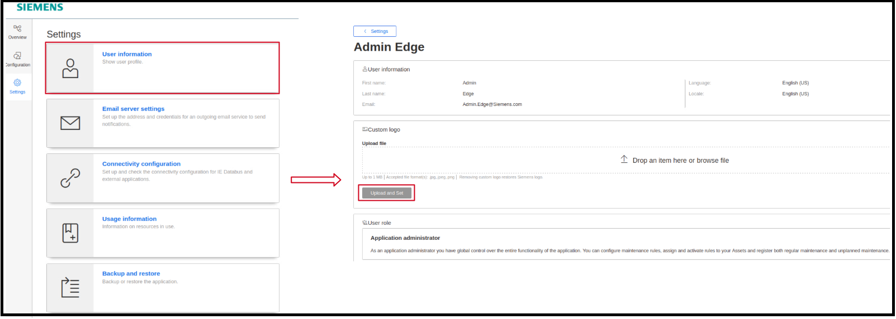

The " Siemens " icon is replaced by the new logo provided by the user and the new logo is now displayed in the top left corner of the application: 

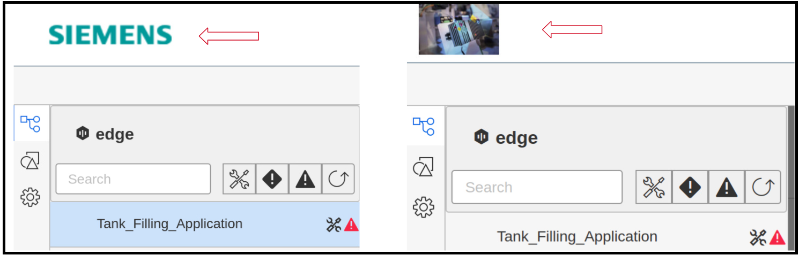

This allows the user to personalize the Machine Monitor app with their own logo, adding a unique touch to the application's appearance.